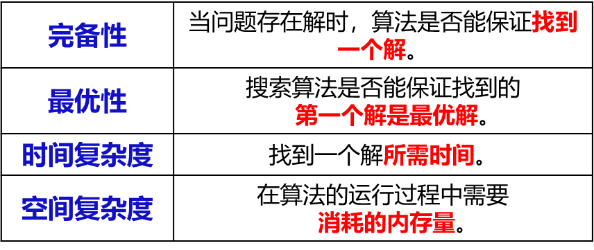
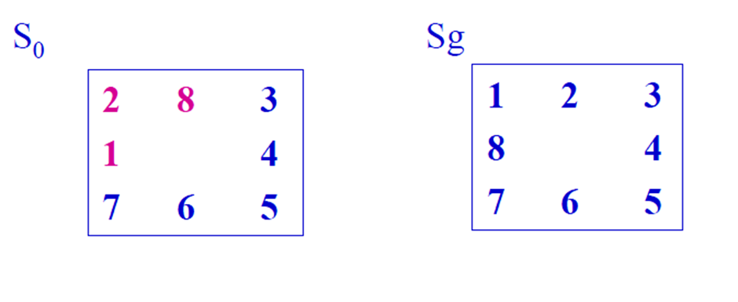
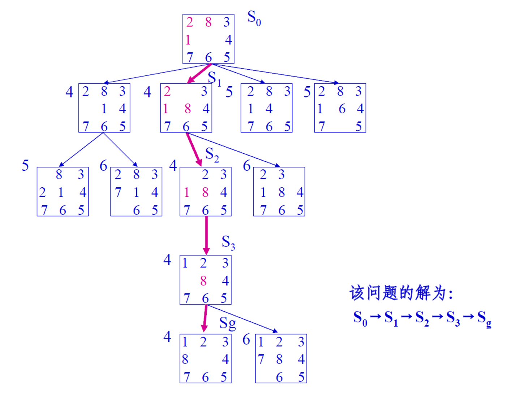
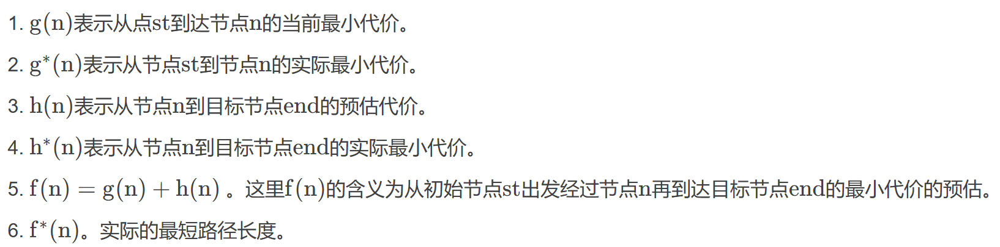
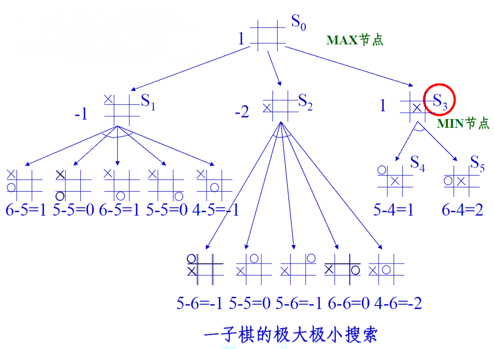
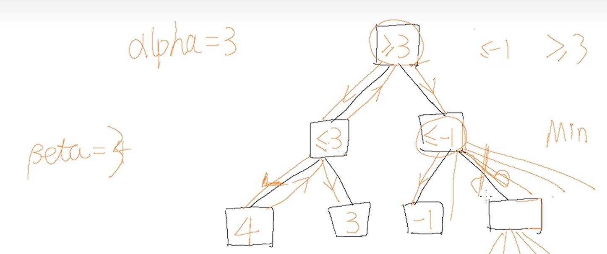

概念：
  - 依靠经验，利用已有知识，根据问题的实际情况，不断寻找可利用知识， 从而构造一条代价最小的推理路线，使问题得以解决的过程称为搜索

适用情况：
  - 不良结构或非结构化问题；难以获得求解所需的全部信息；更没有现成的算法可供求解使用。

搜索的类型
- 按是否使用启发式信息：
  - 盲目搜索：按预定的控制策略进行搜索，在搜索过程中获得的中间信息并不改变控制策略。
  - 启发式搜索：在搜索中加入了与问题有关的启发性信息，用于指导搜索朝着最有希望的方向前进，加速问题的求解过程并找到最优解。
- 按问题的表示方式：
  - 状态空间搜索：用状态空间法来求解问题所进行的搜索
  - 与或树搜索：用问题归约法来求解问题时所进行的搜索

# 状态空间盲目搜索

状态空间搜索的基本思想

    先把问题的初始状态作为当前扩展节点对其进行扩展，生成一组子节点，然后检查问题的目标状态是否出现在这些子节点中。若出现，则搜索成功，找到了问题的解；若没出现，则再按照某种搜索策略从已生成的子节点中选择一个节点作为当前扩展节点。
    重复上述过程，直到目标状态出现在子节点中或者没有可供操作的节点为止。

所谓对一个节点进行“扩展”是指对该节点用某个可用操作进行作用，生成该节点的一组子节点。

算法的数据结构和符号约定
    Open表：用于存放刚生成的节点,未扩展的节点，Open表称为未扩展的节点表。 
    Closed表：用于存放已经扩展或将要扩展的节点，Closed称为已扩展的节点表。
    $S_0$：用表示问题的初始状态
    $S_g$：用表示问题的目标状态

搜索算法的评价指标

完备性和最优性刻画了算法找到解的能力以及所求的解的质量。
时间复杂度和空间复杂度衡量了算法的资源消耗，它们通常用𝓞符号（big O notation）来描述。

搜索树中用于估计复杂度的变量含义

## 广度优先搜索(Breadth-first Search)
**队列实现**

是一种先生成的节点先扩展的策略。

基本思想是：从初始节点S0开始，逐层地对节点进行扩展并考察它是否为目标节点，在第n层的节点没有全部扩展并考察之前，不对第n＋1层的节点进行扩展。

OPEN表中的节点总是按进入的先后顺序排列，先进入的节点排在前面，后进入的排在后面。

广度优先搜索的一般算法
（1）把初始节点$S_0$放入Open表, 建立一个CLOSED表，置为空；
（2）检查Open表是否为空表，若为空，则问题无解，失败退出；
（3）把Open表的第一个节点取出放入Closed表，并记该节点为n；
（4）考察节点n是否为目标节点，若是则得到问题的解成功退出；
（5）若节点n不可扩展，则转第（2）步；
（6）扩展节点n， 将其子节点放入Open表的尾部，并为每个子节点设置指向父节点的指针, 转向第（2）步。

当问题有解时，一定能找到解
属于完备搜索策略
搜索得到的解是搜索树中路径最短的解（最优解）
方法与问题无关，具有通用性
搜索效率较低

完备性: 当问题有解时，一定能找到解
最优性: 得到的解是搜索树中路径最短的解（最优解）
时间复杂度: $𝓞(b^d)$
空间复杂度: $𝓞(b^d)$

## 深度优先搜索（Depth-first search）
**栈实现**

在深度优先搜索中，首先扩展最新产生的(即最深的)节点，是后生成的节点先扩展的策略。

从初始节点S0开始扩展，若没有得到目标节点，则选择最新产生的子节点进行扩展，若还是不能到达目标节点，则再对刚才最新产生的子节点进行扩展，一直如此向下搜索。

当到达某个子节点，且该子节点既不是目标节点又不能继续扩展时，才选择其兄弟节点进行考察。

Open表是一种栈结构，最先进进入的节点排在最后面，最后进入的节点（最新生成的）排最前面。

一般算法:
（1）把初始节点S0放入Open表, 建立一个CLOSED表，置为空；
（2）检查Open表是否为空表，若为空，则问题无解，失败退出；
（3）把Open表的第一个节点取出放入Closed表，并记该节点为n；
（4）考察节点n是否为目标节点，若是则得到问题的解成功退出；
（5）若节点n不可扩展，则转第（2）步；
（6）扩展节点n， 将其子节点放入Open表的首部，并为每个子节点设置指向父节点的指针, 转向第（2）步。

一般不能保证找到最优解
最坏情况时，搜索空间等同于穷举
是一个通用的与问题无关的方法
为了解决深度优先搜索不完备问题，避免搜索过程陷入无穷分支的死循环，提出了有界深度优先搜索方法。

完备性: 不一定找到解（解决方案？）
最优性: 一般不能保证找到最优解
时间复杂度: $𝓞(b^m)$
空间复杂度: $𝓞(bm)$

## 代价一致搜索（Uniform-cost/Cheapest-first search）

前面的各种搜索策略中，实际都假设状态空间中各边的代价都相同，且都为一个单位量。从而，可用路径长度来代替路径的代价。但实际问题中，这种假设不现实，它们的状态空间中的各个边的代价不可能完全相同。为此，我们需要在搜索树中给每条边标上其代价。这种边上有代价的树称为代价树。

在代价树中，可以用g(n)表示从初始节点S0到节点n的代价，用c(n1, n2)表示从父节点n1到n2的代价。这样，对节点n2的代价有

g(n2) = g(n1) + c(n1, n2)

在代价树中，最小代价的路径和最短路径是有可能不同的，最短路径不一定是最小代价径，最小代价路径也不一定是路径最短。代价树搜索的目的是为了到最佳解，即找到一条代价最小的解路径。

搜索树中每条连接线上的有关代价,表示时间、距离等花费。     

**代价一致搜索是宽度优先搜索的一种推广**，不是沿着等长度路径断层进行扩展，而是**沿着等代价路径断层**进行扩展。   	
    
代价一致搜索的基本思想是：在代价一致搜索算法中，把从起始节点S0到任一节点i的路径代价记为g(i)。从初始节点S0开始扩展，若没有得到目标节点，则**优先扩展最少代价g(i)的节点**，一直如此向下搜索。

一般算法

（1）把初始节点S0放入Open表,设g（s0）=0, 建立一个CLOSED表，置为空；
（2）检查Open表是否为空表，若为空，则问题无解，失败退出；
（3）把Open表的第一个节点取出放入Closed表，并记该节点为n；
（4）考察节点n是否为目标节点，若是则得到问题的解成功退出；
（5）若节点n不可扩展，则转第（2）步；
（6）扩展节点n， 生成子节点ni（i=1,2,……），将其子节点放入Open表，并为每˜个子节点设置指向父节点的指针，计算各个节点的代价**g（ni） ，将Open表内的节点按g（ni）从小到大排序**, 转向第（2）步。

完备性: 当问题有解时，一定能找到解
最优性: 得到的解是代价最小的解（最优解）
时间复杂度: 𝓞(b^ (C*/ε))
空间复杂度: 𝓞(b^ (C*/ε))

# 状态空间启发式搜索
启发性信息
  启发性信息是指那种与具体问题求解过程有关的，并可指导搜索过程朝着最有希望方向前进的控制信息。
  启发信息的启发能力越强，扩展的无用结点越少。包括以下3种：
  ①有效地帮助确定扩展节点的信息；
  ②有效地帮助决定哪些后继节点应被生成的信息；
  ③能决定在扩展一个节点时哪些节点应从搜索树上删除的信息。
## 贪心算法

## A算法
估价函数
  用来估计节点重要性，定义为从初始节点S0 出发，经过节点n到达目标节点Sg 的所有路径中最小路径代价的估计值。一般形式：
    f(n)=g(n)+h(n)
  其中，g(n)是从初始节点S0 到节点n的实际代价；h(n)是从节点n到目标节点Sg 的最优路径的估计代价。

概念：
  在状态空间搜索中，如果每一步都利用估价函数f(n)=g(n)+h(n)对Open表中的节点进行排序，则称A算法。它是一种为启发式搜索算法。

A算法描述：
(1)把初始节点S0 放入Open表中，f(S0 )=g(S0 )+h(S0 )；
(2)如果Open表为空，则问题无解，失败退出；
(3)把Open表的第一个节点取出放入Closed表，并记该节点为n；
(4)考察节点n是否为目标节点。若是，则找到了问题的解，成功退出；
(5)若节点n不可扩展，则转第(2)步；
(6)扩展节点n，生成其子节点ni (i=1, 2, …)，**计算每一个子节点的估价值f(ni )(i=1, 2, …)，**并为每一个子节点设置指向父节点的指针，然后将这些子节点放入Open表中；
(7)根据各节点的估价函数值，对Open表中的全部节点按**从小到大**的顺序重新进行排序；
(8)转第(2)步。

例题:八数码难题。设问题的初始状态S0 和目标状态Sg如下图所示，且估价函数为
    f(n)=d(n)+W(n)
  其中：d(n)表示节点n在搜索树中的深度
    W(n)表示节点n中“不在位”的数码个数。请用全局择优搜索解决该问题。

解：该问题的全局择优搜索树如右图所示。在该图中，每个节点旁边的数字是该节点的估价函数值。
  例如，对节点S2 ，其估价函数值的计算为：f(S2)=d(S2)+W(S2) =1+3=4

你这段话描述得其实挺清楚的，下面我可以帮你更系统地解释一下，便于你更深入理解 A 算法（A* 算法）中启发函数 \( h(n) \) 的作用，以及它不同取值下的行为变化。

---

### A\*算法核心机制

A\* 算法的本质是通过一个代价函数来评估每个节点的“优先级”，公式如下：

\[
f(n) = g(n) + h(n)
\]

- \( g(n) \)：从起点到当前节点 \( n \) 的实际代价。
- \( h(n) \)：从当前节点 \( n \) 到目标节点的启发式估计代价。

A\*算法会优先扩展 \( f(n) \) 最小的节点。

---

### 不同情况下的行为分析

1. **极端情况一： \( h(n) = 0 \)**  
   - 那么：\( f(n) = g(n) \)
   - 只依赖当前路径的实际代价来选择路径。
   - 退化成 **Dijkstra算法（代价一致算法）**，它是最稳妥但通常较慢的情况。
   - 优点：一定能找到最短路径（前提是所有边权非负）。
   - 缺点：扩展节点数多，效率较低。

2. **可接受的启发函数： \( 0 \le h(n) \le \text{真实代价} \)**  
   - 启发函数是**可采纳的（admissible）**，即它**不会高估代价**。
   - A\* 在这种情况下可以保证找到最短路径。
   - 但如果 \( h(n) \) 值较小（尤其趋近于 0），它会更像 Dijkstra，速度慢。

3. **理想情况： \( h(n) = \text{真实代价} \)**  
   - 这时候 A\* 算法只扩展最优路径上的节点。
   - 是 **最优又最快** 的情况，达到理论上最理想的效果。
   - 但在实际中很难做到，因为我们通常并不知道从当前节点到终点的真实代价。

4. **不可靠的启发函数： \( h(n) > \text{真实代价} \)**  
   - 启发函数**高估代价**，也称为不可采纳（inadmissible）。
   - A\* 不再保证找到最短路径（失去最优性）。
   - 好处是：扩展的节点更少，可能运行更快。
   - 是在 **牺牲精度换效率**。

5. **极端情况二： \( h(n) \gg g(n) \)**  
   - 此时 \( f(n) \approx h(n) \)，也就是只看启发式值。
   - 退化为**贪婪最佳优先搜索（Greedy Best-First Search）**。
   - 算法速度可能很快，但路径质量差（不保证是最优路径）。

---

### 总结一张表格方便你记忆：

| 启发函数 \( h(n) \) 的情况 | 行为/算法退化形态             | 是否保证最短路径 | 扩展节点数 | 速度 |
|--------------------------|---------------------------|------------------|------------|------|
| \( h(n) = 0 \)            | Dijkstra                  | ✅ 是             | 多         | 慢   |
| \( 0 < h(n) \le \text{真实代价} \) | 正常 A\*                   | ✅ 是             | 较少       | 中等 |
| \( h(n) = \text{真实代价} \) | 理想 A\*（理论最优）         | ✅ 是             | 最少       | 快   |
| \( h(n) > \text{真实代价} \) | 不可采纳的 A\*              | ❌ 否             | 更少       | 更快 |
| \( h(n) \gg g(n) \)        | 贪婪搜索（Greedy Best-First） | ❌ 否             | 极少       | 最快 |

---

如果你想进一步了解 A\* 在图搜索中的优化策略，比如如何设计启发函数、怎样平衡精度与速度，也可以告诉我！

## A*算法
### 性质证明
https://blog.csdn.net/weixin_42639395/article/details/139715043

定义4.1 如果对A算法（全局择优）中的g(n)和h(n)分别提出如下限制：
  第一，g(n)是对最小代价g*(n)的估计，且g(n)>0；
  第二，h(n)是最小代价h*(n)的下界，即对任意节点n均有h(n)≤h*(n)。
  则称满足上述两条限制的A算法为A*算法。

代价一致搜索算法根据从起始节点到达当前节点的代价对节点进行排序。(即后向代价g(n) ，到达当前状态消耗的代价)

贪婪算法优先考虑距离目标状态更近的节点，基于从该节点到达目标状态的估计代价对节点进行排序。 (即前向代价h(n) ，到目标还需要消耗的代价的估计)

A* 搜索算法根据两者之和（评价函数f(n)）对节点进行排序。
𝒇(𝒏) = 𝒈(𝒏) + 𝒉(𝒏)
评价函数 起始结点到结点𝒏代价(当前最小代价) 结点𝒏到目标结点代价(后续估计最小代价)

一般思想
（1）把初始节点S0放入Open表, 建立一个CLOSED表，置为空；
（2）检查Open表是否为空表，若为空，则问题无解，失败退出；
（3）把Open表的第一个节点取出放入Closed表，并记该节点为n；
（4）考察节点n是否为目标节点，若是则得到问题的解成功退出；
（5）若节点n不可扩展，则转第（2）步；
（6）扩展节点n, 生成子节点ni（i=1,2,……），将其子节点放入Open表，并为每个子节点设置指向父节点的指针，计算各个节点的评价函数f(ni)= g(ni) + h(ni)，将Open表内的节点按f(ni)从小到大排序, 转向第（2）步。
非常好，我们来解释一下你提到的这句话中“**最优性的条件**”到底指的是什么，特别是“启发函数要满足可采纳性”等是什么意思。

### a*算法的可纳性
可纳性的含义：
  定义4.2 对任一状态空间图，当从初始节点到目标节点有路经存在时，如果搜索算法总能在有限步骤内找到一条从初始节点到目标节点的最佳路径， 并在此路径上结束，则称该搜索算法是可采纳的。

A*算法可纳性的证明过程可分以下三步：
第一步，对有限图，A*算法一定能够成功结束。
第二步，对无限图，A*算法也一定能够成功结束。
第三步，A*算法一定能够结束在最佳路径上。

你提到的是**A\*算法可采纳性（admissibility）的严格形式化定义与证明结构**，这是很多教材中对启发式搜索算法“可采纳性”的完整处理。

我们来结合你给出的内容，对这三步做**详细展开与解释**，帮助你理解和整理这份证明。

---

> **当从初始节点到目标节点有路径存在时，如果搜索算法总能在有限步骤内找到一条从初始节点到目标节点的最佳路径，并在此路径上结束，则称该搜索算法是可采纳的。**

换句话说，可采纳算法必须满足：
1. **找到**目标（解存在就必须找到）；
2. **找到最优路径**；
3. **在有限时间内完成（终止）**。

---

### ✅ A\*算法可采纳性的完整证明结构

我们依照你给出的三步来证明 A\* 是可采纳的（假设启发函数 \( h(n) \) 可采纳，即 \( h(n) \le h^*(n) \)）。

---

#### ✅ 第一步：对**有限图**，A\*算法一定能够成功结束

🧠 解释：

- 在有限图中，状态空间是有限的 ⇒ 可扩展节点数是有限的；
- A\* 每次从 OPEN 表中选出 \( f(n) \) 最小的节点扩展；
- 由于总节点有限，A\* 最多扩展有限个节点；
- 一旦目标节点 \( G \) 被扩展（即从 OPEN 表中弹出），算法结束；
- 因此，**一定在有限步内结束**。

---

#### ✅ 第二步：对**无限图**，A\*算法也一定能够成功结束

🧠 解释：

这个情况是更难的，但关键在于：

- 虽然图无限，但路径成本 \( g(n) \) 是单调递增的（因为代价非负）；
- 假设存在一个最短路径的总代价为 \( C^* \)；
- 启发函数满足 \( h(n) \le h^*(n) \)，所以所有满足 \( f(n) = g(n) + h(n) > C^* \) 的节点不会优先被扩展；
- 所以 A\* **只会扩展那些 \( f(n) \le C^* \) 的节点** ⇒ 这些节点是有限个（前提是路径代价下限不为 0）；
- 一旦目标节点被扩展（此时 \( f(G) = g(G) = C^* \)），算法终止；

因此，**尽管图无限，A\* 扩展的节点数依然有限，算法会在有限步内结束。**

✅ 小补充：需要要求边权为正，否则可能出现无限个代价为 \( C^* \) 的路径。

---

#### ✅ 第三步：A\*算法一定能够**结束在最佳路径上**

🧠 解释（这一步是最关键的“最优性证明”）：

假设存在一条从起点 \( S \) 到目标 \( G \) 的最短路径，其总代价为 \( C^* \)。

- 启发函数 \( h(n) \) 是可采纳的 ⇒ 所有在这条最短路径上的中间节点 \( n \)，都有：

\[
f(n) = g(n) + h(n) \le g(n) + h^*(n) = C^*
\]

- 所以最短路径上的所有节点都会被 A\* 以 \( f(n) \le C^* \) 的代价扩展；
- A\* 是按照 \( f(n) \) 从小到大扩展节点的；
- 如果目标节点 \( G \) 第一次从 OPEN 表中弹出（被扩展），那么它的 \( f(G) = g(G) = C^* \)，一定是**最短路径**；
- 如果存在另一个路径代价更大，则 A\* 不会更早扩展它；
- 所以 A\* 一定会在某次扩展中以代价 \( C^* \) 弹出 \( G \)，并结束；

因此，**A\* 一定结束于一条总代价最小的路径上。**

---

#### ✅ 最终结论

结合以上三步，我们证明了：

- A\* 在有限或无限图中都能在有限步内终止；
- A\* 必定找到最短路径；
- 满足“找到 + 找得最优 + 有限步终止” ⇒ **A\* 算法是可采纳的。**

---

### A*算法的最优性
A*算法的搜索效率很大程度上取决于估价函数h(n)。一般来说， 在满足h(n) ≤h*(n)的前提下，h(n)的值越大，说明它携带的启发性信息越多，A*算法搜索时扩展的节点就越少，搜索效率就越高。A*算法的这一特性被称为最优性。
  下面通过一个定理来描述这一特性。

定理4.4 设有两个A*算法A1 *和A2 *，它们有
    A1 *: f1 (n)=g1 (n)+h1 (n)
    A2 *: f2 (n)=g2 (n)+h2 (n)
  如果A2 *比A1 *有更多的启发性信息，即对所有非目标节点均有
    h2 (n)>h1 (n)
  则在搜索过程中，被A2 *扩展的节点也必然被A1 *扩展，即A1 *扩展的节点不会比A2 *扩展的节点少，亦即A2 *扩展的节点集是A1 *扩展的节点集的子集。

### h(n)的单调限制

在A*算法中，是否能够保证，每当扩展一个节点时就已经找到了通往这个节点的最佳路径？

  满足这一要求，需要启发函数h(n)满足单调性限制。

定义4.1 如果启发函数满足以下两个条件: 
    (1) h(Sg )=0; 
    (2) 对任意节点ni 及其任一子节点nj ，都有
    h(ni )-h(nj )≤c(ni , nj )
  其中c(ni , nj )是ni 到其子节点nj 的边代价，则称h(n)满足单调限制。

定理4.5 如果h满足单调条件，则当A*算法扩展节点n时，该节点就已经找到了通往它的最佳路径，即g(n)=g*(n)。
定理4.6 如果h(n)满足单调限制，则A*算法扩展的节点序列的f 值是非递减的，即f(ni )≤f(ni+1 )。

# 博弈树的启发式搜索

博弈树的特点
    (1) 博弈的初始状态是初始节点；
    (2) 博弈树中的“或”节点和“与”节点是逐层交替出现的；
    (3) 整个博弈过程始终站在某一方的立场上，例如MAX方。所有能使自己一方获胜的终局都是本原问题，相应的节点是可解节点；所有使对方获胜的终局都是不可解节点。

对于复杂的博弈问题，不可能生成整个搜索树，如国际象棋，

## 最大最小搜索

一种可行的方法是用当前正在考察的节点生成一棵部分博弈树，并利用估价函数f(n)对叶节点进行静态估值。
    

对叶节点的估值方法是：那些对MAX有利的节点，其估价函数取正值；那些对MIN有利的节点，其估价函数取负值；那些使双方均等的节点，其估价函数取接近于0的值。
    
为非叶节点的值，必须从叶节点开始向上倒退。其倒退方法是：
    对于MAX节点，由于MAX 方总是选择估值最大的走步，因此， MAX节点的倒退值应该取其后继节点估值的最大值。
    对于MIN节点，由于MIN方总是选择使估值最小的走步，因此MIN 节点的倒推值应取其后继节点估值的最小值。
这样一步一步的计算倒推值，直至求出初始节点的倒推值为止。这一过程称为**极大极小过程**。

例：一子棋游戏
设有一个三行三列的棋盘，如下图所示，两个棋手轮流走步，每个棋手走步时往空格上摆一个自己的棋子，谁先使自己的棋子成三子一线为赢。设MAX方的棋子用×标记，MIN方的棋子用○标记，并规定MAX方先走步。
解：
估价函数e(+P)：P上有可能使×成三子为一线的数目；
e(-P)：P上有可能使○成三子为一线的数目；
当MAX 必胜e(P)为正无穷大；
MIN 必胜e(P)为负无穷大。
e(P)=e(+P)-e(-P)
棋局即估价函数
具有对称性的棋盘可认为是同一棋盘。如下图所示：

×为MAX方的棋子
○为MIN方的棋子 
一子棋的极大极小搜索
设MAX方先走步：

## alpha-beta剪枝

视频举例
【十分钟暴力讲解博弈树五子棋AI极大极小搜索Alpha-Beta剪枝】 https://www.bilibili.com/video/BV1nU4y1V788/?share_source=copy_web&vd_source=9d6e13bf85154299c6c9914751e93280

剪枝的概念
  在极大极小搜索过程中，剪去一些没用的分枝，减少了搜索空间，使得算法在同样时间内可以搜索更深层，这种技术被称为α-β剪枝。

剪枝方法
    (1) MAX节点（或节点）的α值为当前子节点的最大倒推值；
    (2) MIN节点（与节点）的β值为当前子节点的最小倒推值；
    (3) α-β剪枝的规则如下：
  α剪枝
  任何MAX节点n的α值大于或等于它先辈节点的β值，则n 以下的分枝可停止搜索，并令节点n的倒推值为α。这种剪枝称为α剪枝。
  β剪枝
  任何MIN节点n的β值小于或等于它先辈节点的α值，则n 以下的分枝可停止搜索，并令节点n的倒推值为β。这种剪枝称为β剪枝。

# 蒙特卡洛树搜索

